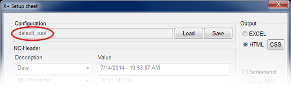
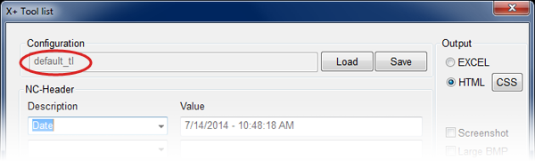
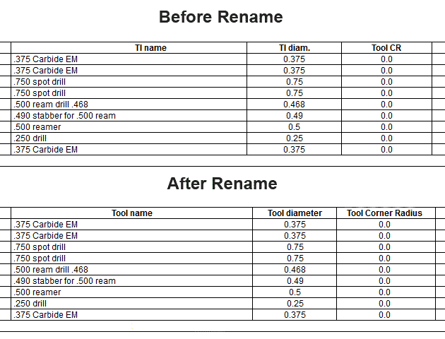

xplus-rename
============

A Javascript file to work in conjunction with the Mastercam add-on X+ Setup Sheet. This does not work with the Excel setup sheet and tool list.

## General ##

[Mastercam](http://www.mastercam.com/en-us/ "Mastercam") is a CAD/CAM package that creates toolpaths to drive your CNC machines. [X+](http://gmccs.de/?page=downloads.php&dl_grp=8&pt=X%2B+Tool+Downloads "X+") is a free add-on that creates setup sheets and tool lists from those toolpaths so the machine operator has a road map of how to set the job up, what tools are needed, how the part is being machined, etc.

The setup sheet and tool list can be output in HTML or Excel format. HTML output allows you to use your own Javascript file for further customization. These Javascript files allow you to change the column names of your setup sheet and tool list.

Since X+ is configurable to use as few or as many columns as you'd like in your setup sheets, I have included every column option available in X+ in this script.

The typical user of these files will likely have no experience with Javascript since it is not a skill that is typically associated with a machinist/CAM programmer.

## About the script ##

### **What does this file do?** ###

Once you define your new column names, X+ will use those names whenever you create a setup sheet or tool list.

### **What *doesn't* this file do?** ###

This file does not add any extra functionality to X+ Setup Sheet and Tool List. It simply changes the name that appears at the top of each column.

## How to use it ##

1) Download the [Setup Sheet](https://github.com/thadseaver/xplus-rename/blob/cfcd031c530b43805d7902a0c227ed9bbc23421c/js/default_xss.js "Setup sheet") and/or [Tool List](https://github.com/thadseaver/xplus-rename/blob/cfcd031c530b43805d7902a0c227ed9bbc23421c/js/default_tl.js "Tool List") Javascript files for Mastercam X6 and X7 and place them in your .../public/documents/X+ folder with the rest of the X+ files.

*Note: Files for Mastercam X8 are now available. [Setup Sheet](https://github.com/thadseaver/xplus-rename/blob/291ccbda1583398167dfd0861230621757f31af2/js/default_xss_x8.js "X8 Setup Sheet"), [Tool List](https://github.com/thadseaver/xplus-rename/blob/291ccbda1583398167dfd0861230621757f31af2/js/default_tl_x8.js "X8 Tool List").

*Note: Files for Mastercam X9 are now available. [Setup Sheet](https://github.com/thadseaver/xplus-rename/blob/cecfdbf6e81846cd1abbd4829e8ec1726132b443/js/default_xss_x9.js "X9 Setup Sheet"), [Tool List](https://github.com/thadseaver/xplus-rename/blob/cecfdbf6e81846cd1abbd4829e8ec1726132b443/js/default_tl_x9.js "X9 Tool List").

### Rename the .js file to match your configuration name. ###

2) Maybe you have a different configuration file for each machine? No problem! For each of your different configuration files, name a copy of the .js file by the same name. Your configuration file names can be found here.

In the above examples, your .js files would be named default\_xss.js and default\_tl.js. 

### Change the column names ###

3) Open the .js file with a text editor like Notepad. Do not use a word processor like MS Word. To change the column names of your X+ Setup Sheet, edit 'Your text here' that corresponds to the default column name. Be sure that your text is wrapped in single quotes after you make any edits.

4) Remove the "//" comment marker from the beginning of every line of code that you edited. If you ever want to undo your change, add "//" to the beginning of the line of code that you want to undo. Save your file after making any changes.

### Example: ###

Say, instead of 'Tl name', you want it to say 'Tool name'. Find the line of code that has the existing name in the first set of single quotes and edit the 'Your text here' on that same line in the second set of single quotes. (The script contains every column option available in X+ Setup Sheet and Tool List.) So this line:

`//colNames[i].innerHTML = colNames[i].innerHTML.replace('Tl name', 'Your text here');`

should be changed to this:

`colNames[i].innerHTML = colNames[i].innerHTML.replace('Tl name', 'Tool name');`

### Notes: ###

If you use Internet Explorer as your browser, you may have to accept the use of this script and "allow blocked content" when you see the pop-up.

